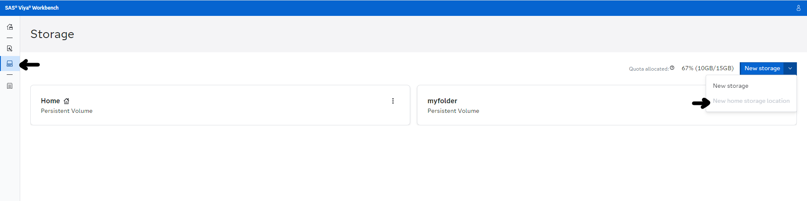
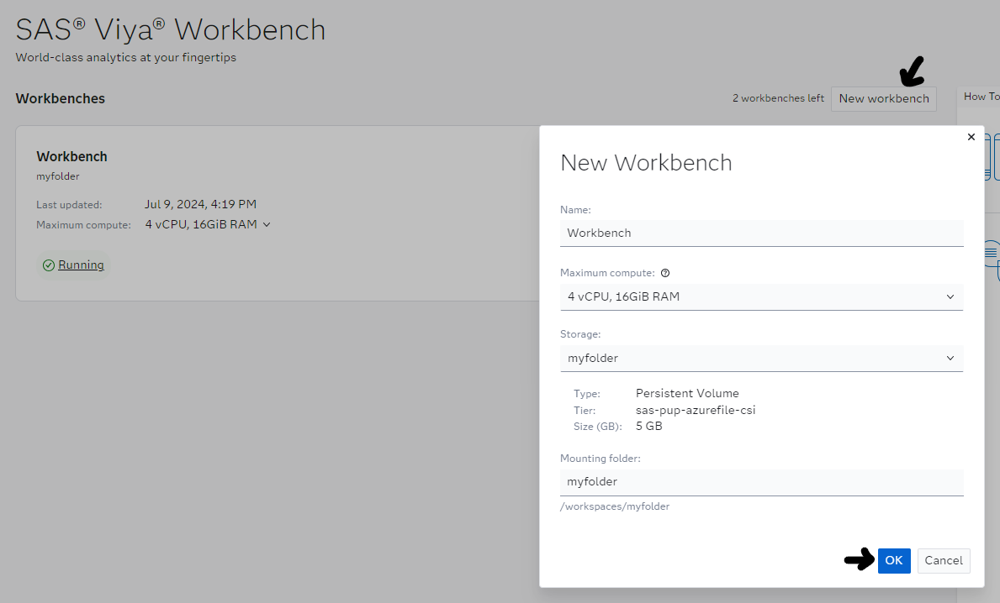
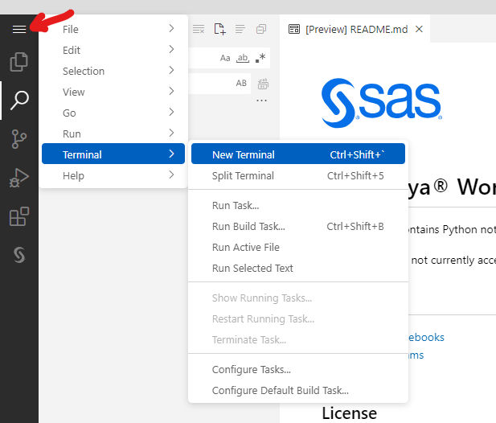
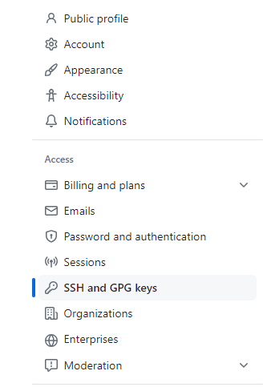
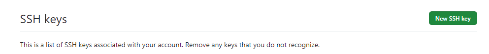
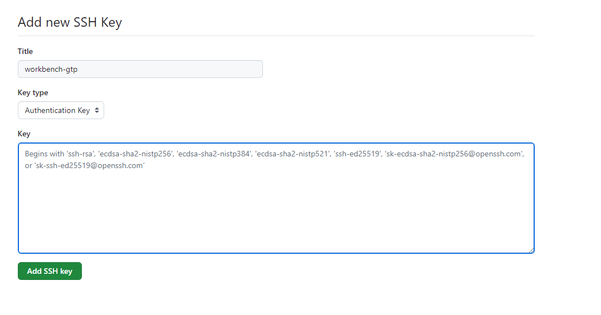
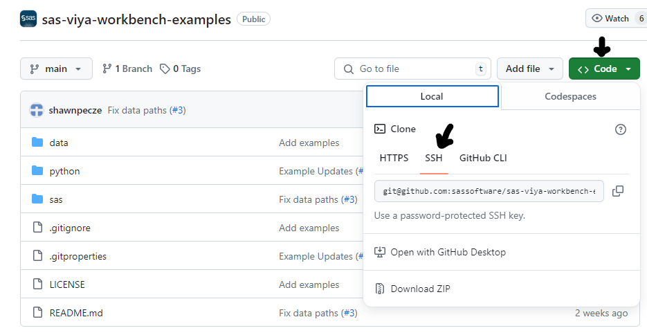
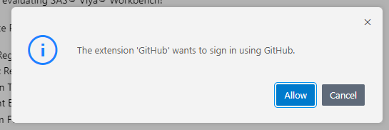
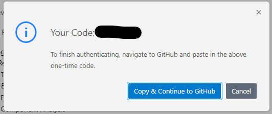
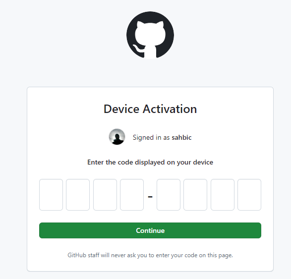

# workbench-handson

## Clone your GitHub repository in Workbench

### SSH

1. Create a Home Persistent Volume on Workbench
    - Go to "Storage" tab
    - Click "New Storage"
    - Select "New home storage location"



2. Create a new Workbench, and start it.



3. Open a **New Terminal**.



4. Copy the public ssh key present in `/home/sas/.ssh`, you can type this command in the terminal:

```bash
cat /home/sas/.ssh/id_rsa.pub
```

5. Add this key to your Github
    - On [github.com](github.com), go to **Settings**
    - Click on **SSH and GPG keys**

    
    - Create a **New SSH key**

    
    - Fill the title field and paste your ssh public key in the **Key** field

    
    - Click on **Add SSH key**

6. Clone your repository using the provided SSH link

```bash
git clone git@github.com:YOUR-USERNAME/YOUR-REPOSITORY.git
```

> *Note:* Depending on your version, you may encouter an issue due to the file permissions, if you get an error: `Permissions 0777 for '/home/sas/.ssh/id_rsa' are too open.`, you can use the command below to fix it.
You can also add it to `/home/sas/.bash_profile` to avoid running it for each new workbench.

```bash
eval "$(ssh-agent -s)" && cat /home/sas/.ssh/id_rsa | ssh-add -k -
```

### HTTPS

1. Copy the HTTPS URL of your repository

2. In VSCode, start a new Terminal and type:
```bash
git clone https://github.com/YOUR-USERNAME/YOUR-REPOSITORY
```
3. Click "Allow"



4. Click "Copy & Continue on Github"



5. Paste your code to authorize the new device



6. Configure your instance with your Github user information
```bash
git config --global user.name "USERNAME"
git config --global user.email "EMAIL_ADDRESS"
```
- using a `--global` settings does not persist when starting/stopping Workbenches
- using `--local` instead of `--global` can persist if your repository is on a persistant volume, but needs to be done for each new project.
```bash
git config --local user.name "USERNAME"
git config --local user.email "EMAIL_ADDRESS"
```
